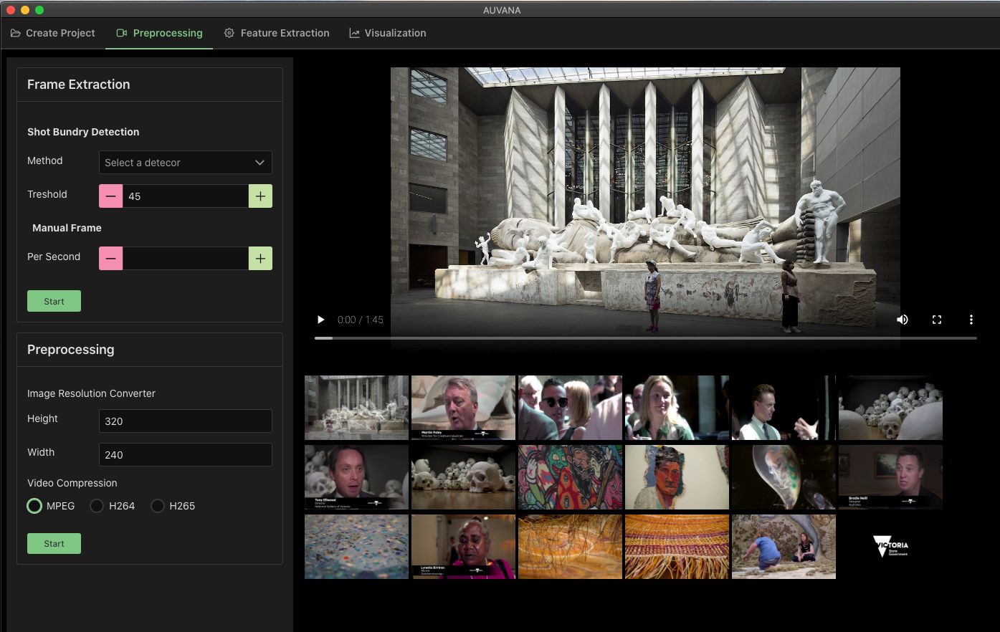
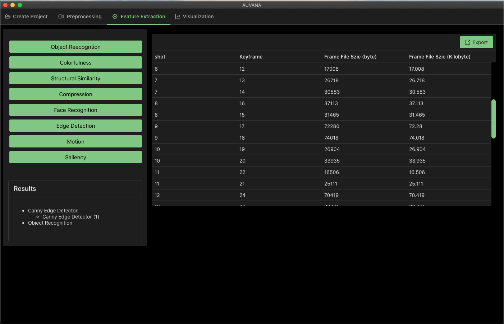
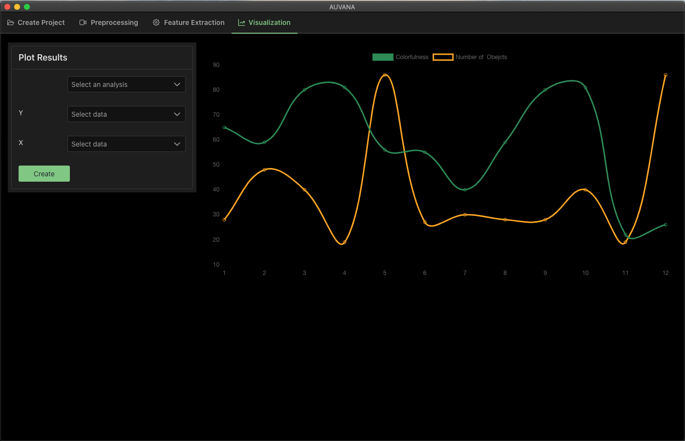

# AUVANA (v 0.1.0)

AUVANA is an automated tool for extracting, computing, and visualizing complexity in videos using techniques and algorithms from the field of computer vision and video processing. The current version (v 1.0.1) commutes the following complexity indices/features

1.	Shot boundary Detection 
2.	Extraction of frames
3.	Object detection 
4.	Video compression
5.	Saliency detection 
6.	Colorfulness
7.	Structural similarity 
8.	Face recognition 
9.	Edge detection 
10.	Motion detection and estimation

# Downloading the software 

## For Mac users
https://bit.ly/3vsn6FE

## For Windows user 
https://bit.ly/3EYMAgH

 

# If you use the software please cite this study 
https://osf.io/kj9hx/

To build the tool locally 

for node_modules
yarn install

for build
yarn electron:build
